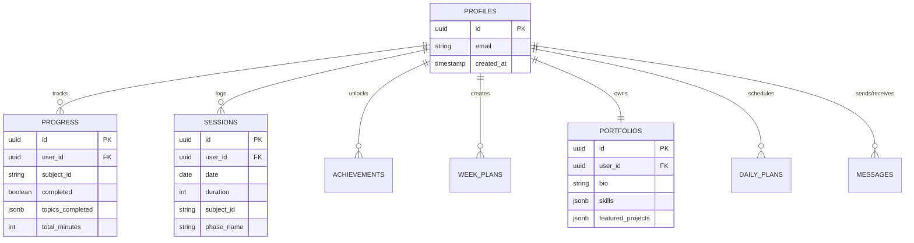

# CS Ultimate Curriculum Tracker: Advanced Learning Management System
## Comprehensive Technical Documentation & Thesis Report

**Target Audience:** Academic Reviewers, Evaluating Professors, and Future Software Engineers

---

## Abstract

The **CS Ultimate Curriculum Tracker** is a high-performance, intelligent learning management system engineered specifically for developers transitioning into Machine Learning and Advanced Software Engineering. This document serves as a comprehensive technical thesis detailing the architectural design, state management strategies, component hierarchy, and database schema that drive the platform. By leveraging a decoupled frontend-backend architecture with a React/Vite ecosystem and a Supabase backend, the system guarantees low-latency updates, secure offline-capable data synchronization, and an immersive user experience.

---

## Chapter 1: Introduction

### 1.1 Project Background
The rapid evolution of computer science disciplines requires engineers to constantly upskill. Traditional spreadsheets or generic task managers fail to provide the structured, phase-based progression required for complex fields like Machine Learning. The CS Ultimate Curriculum Tracker was conceptualized to solve this by providing an opinionated, phase-by-phase roadmap wrapped in an engaging, gamified interface.

### 1.2 Objectives
The primary objectives of this system are:
1. **Structured Learning Paths:** To guide users through a curated, multi-phase curriculum ranging from algorithmic foundations to advanced AI deployment.
2. **Real-Time Progress Tracking:** To instantly calculate mastery percentages and study streaks using local state synchronization.
3. **Career Tool Integration:** To translate learning progress directly into actionable career assets, such as ATS-optimized resume keywords and dynamic GitHub portfolios.
4. **Resilient Data Architecture:** To ensure user data is securely stored, rapidly retrieved, and protected via robust Row Level Security (RLS).

---

## Chapter 2: System Architecture & Technology Stack

The application employs a modern JAMstack architecture, ensuring a strict separation between the client-side presentation and server-side data persistence.

### 2.1 Architectural Pattern: Component-Based Architecture & Global State
The system avoids traditional MVC in favor of a component-based paradigm:
- **Components (Views):** React functional components that aggressively utilize Hooks for local state and side effects.
- **Global State Store (Zustand):** Acts as the single source of truth for the frontend, replacing heavy reducers (like Redux) with a minimalist, highly performant state tree.
- **Data Access Layer:** A dedicated Supabase client utility that handles all asynchronous communication with the PostgreSQL backend.

### 2.2 Frontend Technologies
- **Framework:** React 18, bootstrapped with Vite for instant Hot Module Replacement (HMR) and optimized build assets.
- **Language:** TypeScript, providing rigorous static typing for interfaces like `Progress`, `Session`, and `DailyPlan`, virtually eliminating runtime type errors.
- **Styling:** Tailwind CSS, enabling utility-first, highly responsive designs with custom theme extensions (e.g., glassmorphism, dynamic dark mode).
- **Data Visualization:** Recharts, used to render interactive, scalable vector graphics (SVG) charts for analytics.
- **Animations:** Framer Motion, powering fluid micro-interactions and route transitions to provide a "premium" feel.

### 2.3 Backend & Infrastructure
- **Database & Auth:** Supabase (PostgreSQL). It acts as both the relational database and the identity provider.
- **Deployment:** Vercel. Connected via CI/CD to the GitHub repository, automatically deploying the application upon main branch updates.

---

## Chapter 3: Database Design & Entity Relationship

The system's data integrity is managed by a normalized PostgreSQL database hosted on Supabase.

### 3.1 Entity Relationship Diagram (ERD)

### 3.2 Data Dictionary & Core Tables
1. **`profiles`**: Tied directly to the Supabase `auth.users` table. Stores core identity and preferences.
2. **`progress`**: The granular tracking table. Uses `JSONB` columns (`topics_completed`, `projects_completed`) to flexibly store arrays of completed sub-items without requiring complex junction tables.
3. **`sessions`**: An immutable log of study intervals. Crucial for generating the heatmap analytics and calculating total study hours.
4. **`week_plans` & `daily_plans`**: Scheduling tables that allow the user to block out time. Structured with JSONB to quickly map out variable daily tasks.
5. **`portfolios`**: A 1-to-1 relationship with `profiles`. Stores the aggregated, user-defined data used to generate the exportable markdown portfolio.

---

## Chapter 4: Module Specifications

### 4.1 The Dashboard & Analytics Module
- **Live Metrics:** Uses `Zustand` to aggregate the `progress` array, instantly calculating the overall completion percentage.
- **Heatmap Generation:** Parses the `sessions` table, grouping them by date using `date-fns`, and feeds the transformed array into Recharts to visualize study consistency and streaks.

### 4.2 The Curriculum Viewer
- **Phase Rendering:** Iterates over the complex, nested JSON structure of the curriculum (Phases -> Subjects -> Topics).
- **Optimistic Updates:** When a user checks a topic, the UI updates instantly via Zustand, and a debounced API call is fired in the background to update Supabase, ensuring a zero-latency feel.

### 4.3 Career Tools Integration
- **Resume Optimizer:** An algorithm that cross-references the user's `progress.completed_subjects` against an internal dictionary of industry-standard keywords, outputting a "delta" list of missing CV keywords.

---

## Chapter 5: Complete Application Process Flow

This section details the lifecycle of the user journey, explaining the data flow from client to database.

### Phase 1: Authentication & Hydration
1. **Sign-In:** The user authenticates via Supabase Auth. A secure JWT is issued and stored in local storage/cookies.
2. **State Hydration:** Upon successful login, the `App.tsx` triggers a `fetchUserData` action in Zustand. Parallel API calls are dispatched to Supabase to retrieve `progress`, `sessions`, and `daily_plans`.
3. **Render:** The Zustand store populates, causing the React component tree to re-render, displaying the user's personalized dashboard.

### Phase 2: Active Study Session
4. **Timer Initiation:** The user navigates to a Subject and starts the `SessionTimer`. The timer state is kept in Zustand to persist across route changes.
5. **Session Completion:** The user stops the timer. The frontend calculates the `duration` (e.g., 45 minutes).
6. **Data Construction:** A `Session` object is created and a mutation is dispatched to Supabase.
7. **Progress Update:** Concurrently, the specific `Progress` record for that subject is updated (incrementing `total_minutes`).

### Phase 3: Analytics Re-Calculation
8. **Reactivity:** Because the Zustand store was updated optimally, the `Analytics.tsx` component immediately reflects the new study session on the heatmap. No page reload is required.

---

## Chapter 6: Security & Data Integrity Highlights

1. **Row Level Security (RLS):** The most critical security feature. Supabase RLS is configured so that users can only `SELECT`, `INSERT`, `UPDATE`, or `DELETE` rows where `user_id == auth.uid()`. Even if the frontend API keys are exposed, malicious actors cannot access other users' data.
2. **Type Safety:** The entire application strictly enforces TypeScript interfaces, ensuring that malformed data (e.g., submitting a string instead of an integer for a session duration) is caught at compile time.
3. **Optimistic UI with Rollback:** While the UI updates immediately on user interaction, the application listens for Supabase HTTP errors. If an update fails (e.g., due to a network drop), the Zustand store automatically rolls back to the previous state, preventing UI/Database desync.

---

## Conclusion
The CS Ultimate Curriculum Tracker demonstrates an advanced implementation of modern frontend practices. By combining the reactive power of React and Zustand with the serverless scalability of Supabase, it provides a seamless, secure, and deeply engaging tool for educational tracking. The architecture is built for scale, easily supporting future additions such as social leaderboards or AI-driven curriculum recommendations.
